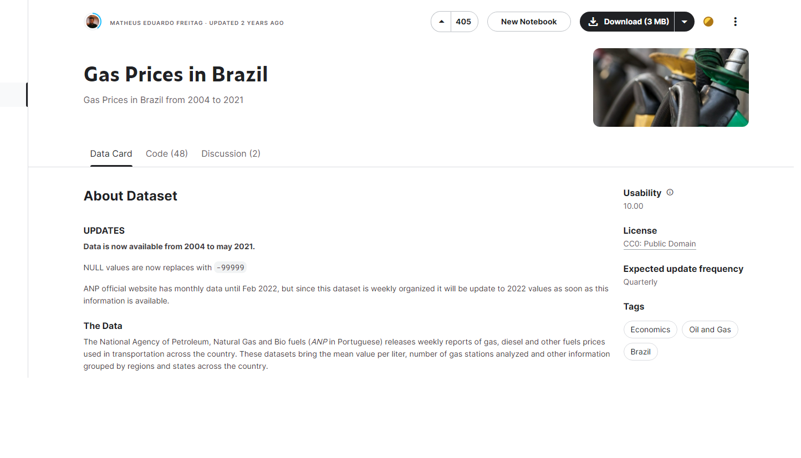

## Projeto Power B.I
Repositório dedicado ao projeto final do módulo 4 - Power B.I- do programa **Vem Ser Tech - Dados**

**Participantes:** 

- <i class="fa fa-computer" aria-hidden="true"></i>:computer:
**Andreza Oliveira**
- <i class="fa fa-computer" aria-hidden="true"></i>:computer:
**Camila Lima**
- <i class="fa fa-computer" aria-hidden="true"></i>:computer:
**Lívia Nobre**
  
## Conteúdo
- [Sobre o Projeto](#Sobreoprojeto)
- [Objetivos](#Objetivos)
- [Dataset Utilizado](#DataSetUtilizado)
- [Insights](#Insights)
- [Metodologia](#Metodologia)
- [Conclusão](#Conslusão)
  

## Sobre o Projeto
Os preços dos combustíveis têm sido uma pauta relevante e impactante no cenário econômico do Brasil. Variações nos preços  não apenas afetam diretamente os consumidores, mas também têm implicações profundas em setores econômicos diversos, como transporte, indústria e agricultura.

  

## Objetivos

Analisar os fatores que influenciam os preços de combustíveis no Brasil;

Analisar tendências temporais;

Analisar variações por localidade

## Dataset Utilizado
O dataset utilizado foi encontrado na plataforma Kaggle, trata sobre os preços de combustíveis no Brasil dos anos de 2004 a 2021. A Agência Nacional do Petróleo, Gás Natural e Biocombustíveis (ANP) criada em 1997 divulga relatórios semanais dos preços do gás, diesel e outros combustíveis utilizados no transporte em todo o país. Esses conjuntos de dados trazem o valor médio por litro, número de postos analisados e outras informações agrupadas por regiões e estados em todo o país.

 
 

https://www.kaggle.com/datasets/matheusfreitag/gas-prices-in-brazil

## Insights

Média de preço de revenda por ano e produto;
Diferenças entre preço mínimo e máximo de revenda da gasolina por região em 2020;
Diferenças entre preço mínimo e máximo de revenda por trimestre e produto;
Preço máximo de distribuição por região em 2020
Percentual de produtos por postos pesquisados por região;
Quantidade de postos por região;
Média de lucro por Estado;
Média de Preço de Distribuição por Ano e Região

## Metodologia

Utilização do Power BI
Tratamento de Dados
Criação de Visualizações

 

 

## Conclusão

